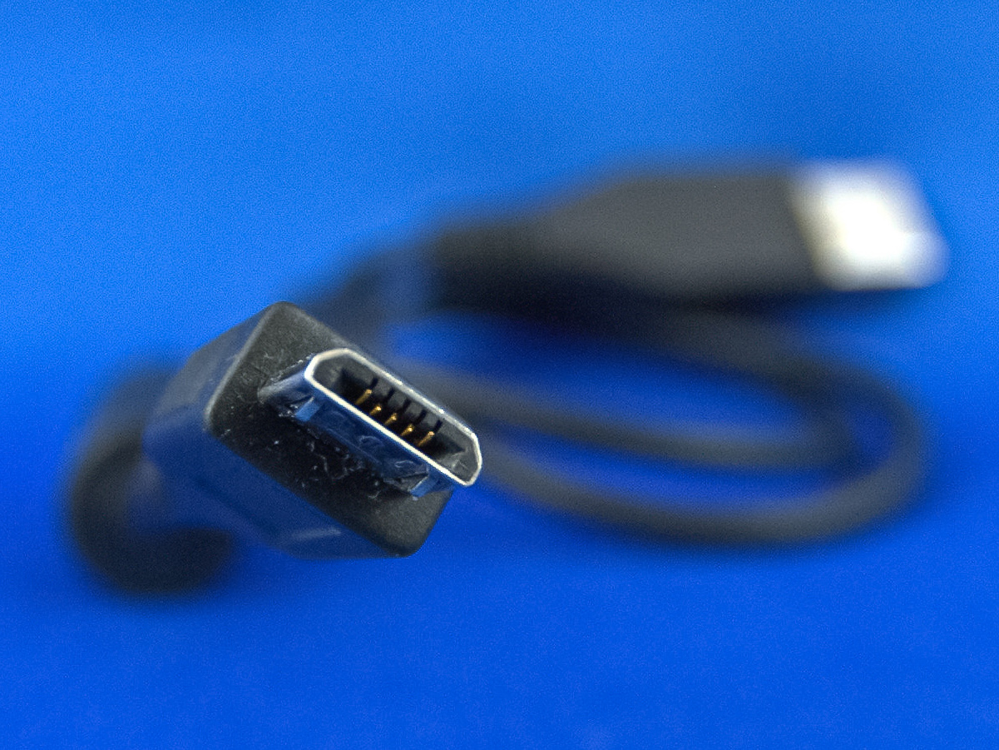

# Waveshare Jetson Nano Setup

This tutorial is for Jetson Nano 4GB version from Waveshare. You can check their official tutorial from [here](https://www.waveshare.net/wiki/JETSON-NANO-DEV-KIT).

The system version is Jetpack r32.7.4 (latest). And Jetson Nano **doesn't** support **higher** version.

## Requirement

### Hardware

1. Waveshare Jetson Nano 4GB
2. 5V 4A Power Adapter
3. Jumper (or female-female cable)
4. Micro-USB Cable
   
5. Monitor supporting HDMI or DP, and cable.
6. SD Card and Reader (Optional)

### Software

A Debian-based Linux system (Debian, Ubuntu, RaspberryPi OS). You can use Raspberry Pi or a virtual machine.

> I tested Debian 12 on VMware Fusion for MacBook. That works.

Make sure your Linux System can access your USB connected device.

## Step 1 - Download Resource

**On your Linux System:**

1. Make a new Dictionary

   ```Shell
   mkdir jetson
   cd jetson
   ```

2. Download Resources

   ```Shell
   wget https://developer.nvidia.com/embedded/l4t/r32_release_v7.4/t210/jetson-210_linux_r32.7.4_aarch64.tbz2
   wget https://developer.nvidia.com/embedded/l4t/r32_release_v7.4/t210/tegra_linux_sample-root-filesystem_r32.7.4_aarch64.tbz2
   ```

3. Unzip
   ```Shell
   tar -xjf jetson-210_linux_r32.7.4_aarch64.tbz2
   cd Linux_for_Tegra/rootfs/
   tar -xjf ../../tegra_linux_sample-root-filesystem_r32.7.4_aarch64.tbz2
   cd ../
   sudo ./apply_binaries.sh
   ```

## Step 2 - Setup Device

1. Jumper the `FC REC` pin and `GND` pin. (Recovery Mode)
2. Connect the DC Power. Wait few seconds.
3. Connect the Jetson Nano and Linux System using Micro-USB cable.

## Step 3 - Flash!

Run:

```Shell
sudo ./flash.sh jetson-nano-emmc mmcblk0p1
```

> File `flash.sh` is in `Linux_for_Tegra` dictionary.\

Wait until it is done.

## Step 4 - Almost Done

Linux system is prepared. You can reboot and set it up like Ubuntu 18.

# If you want...

The size of EMMC disk on the board is 16 GB. If you want to put the system on a SD card, do this.

## Step 5 - De-Compile

1. Install the tool application.

   ```Shell
   sudo apt-get install device-tree-compiler
   ```

2. De-compile the `dts` file.

   > Make sure you are in `Linux_for_Tegra` dictionary.

   ```Shell
   cd kernel/dtb
   sudo dtc -I dtb -O dts -o tegra210-p3448-0002-p3449-0000-b00.dts tegra210-p3448-0002-p3449-0000-b00.dtb
   ```

3. Edit the device tree.

   ```Shell
   sudo vim tegra210-p3448-0002-p3449-0000-b00.dts
   ```

   Find `sdhci@700b0400` part. Change the `status` value from `disable` to `okay`.

   Add these infomation into this part.

   ```
   cd-gpios = <0x5b 0xc2 0x0>;
   sd-uhs-sdr104;
   sd-uhs-sdr50;
   sd-uhs-sdr25;
   sd-uhs-sdr12;

   no-mmc;
   ```

   Change `uhs-mask` value to `<0xc>`.

   ```
   uhs-mask = <0xc>;
   ```

4. Re-compile the `dtb` file.
   ```Shell
   dtc -I dts -O dtb -o tegra210-p3448-0002-p3449-0000-b00.dtb tegra210-p3448-0002-p3449-0000-b00.dts
   ```

## Step 6 - Flash Again

Run:

```Shell
sudo ./flash.sh jetson-nano-emmc mmcblk0p1
```

> File `flash.sh` is in `Linux_for_Tegra` dictionary.\

Wait until it is done.

Then set your system configution (username and password).

## Step 7 - Setup the SD Card

Just *simply* move the system file to SD card. And then tell the Linux boot from SD card in the future.

**In the Jetson Nano System:**

1. Check the SD Card

   ```Shell
   sudo ls /dev/mmcblk*
   ```

2. Unmount the card.

   ```Shell
   sudo umount /media/(Use TAB button to fix)
   ```

3. Erase the SD Card

   ```Shell
   sudo mkfs.ext4 /dev/mmcblk1
   ```

4. Check again

   ```Shell
   sudo ls /dev/mmcblk*
   ```

5. Edit booting path

   ```Shell
   sudo vi /boot/extlinux/extlinux.conf
   ```

   Find this text:

   ```
   APPEND ${cbootargs} quiet root=/dev/mmcblk0p1 rw rootwait rootfstype=ext4 console=ttyS0,115200n8 console=tty0
   ```

   Change `mmcblk0p1` to `mmcblk1`.

6. Mount the card

   ```Shell
   sudo mount /dev/mmcblk1 /mnt
   ```

7. Copy the system file to SD card.

   ```Shell
   sudo cp -ax / /mnt
   ```

   No log, no output, just wait.

8. Unmount the card (Do not unplug it.)

   ```Shell
   sudo umount /mnt/
   ```

9. Reboot
   ```Shell
   sudo reboot
   ```
